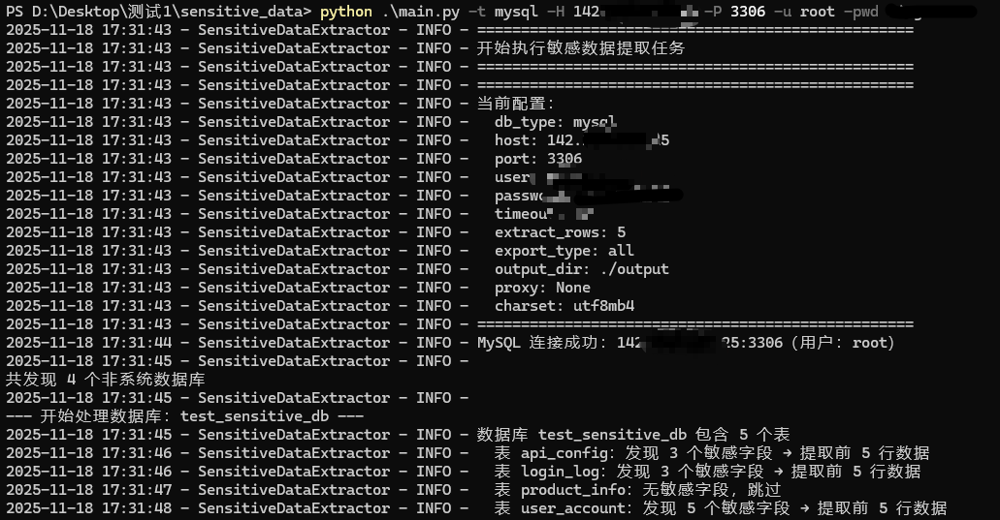
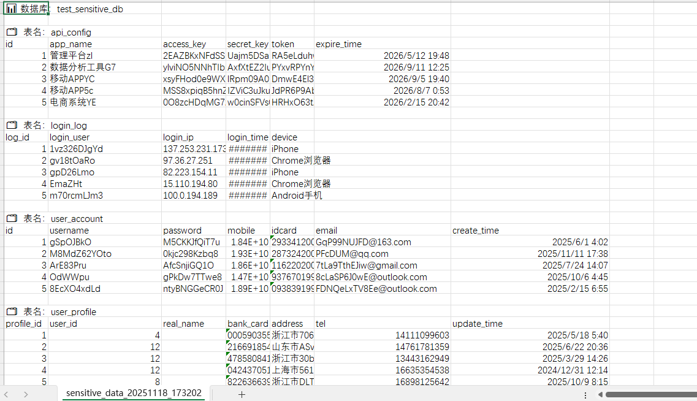

# 敏感数据探测工具

## 项目介绍

这是一个功能强大的敏感数据探测工具，能够连接到多种数据库系统，自动扫描和识别包含敏感信息的表和字段，并将结果导出为CSV或JSON格式。该工具适用于数据库安全审计、合规性检查和隐私保护评估等场景。

## 功能特点

- **多数据库支持**：兼容MySQL、Oracle、SQL Server等主流数据库系统
- **敏感数据识别**：自动识别包含个人身份信息(PII)、信用卡信息、密码等敏感数据的字段
- **可配置的关键词规则**：通过配置文件自定义敏感数据关键词和规则
- **灵活的导出格式**：支持CSV和JSON两种导出格式
- **详细的日志记录**：记录探测过程中的关键操作和错误信息
- **代理支持**：可配置代理服务器进行数据库连接
- **服务名自定义**：Oracle数据库支持自定义服务名

## 支持的数据库类型

- MySQL
- Oracle
- SQL Server

## 安装说明

### 环境要求

- Python 3.8+
- 通过requirements.txt安装需要的库
- 下载sqlserver连接需要的驱动

### 安装步骤

1. **克隆或下载项目**

   ```bash
   git clone [项目仓库地址]  # 如果是通过git获取
   # 或直接下载项目压缩包并解压
   ```

2. **安装依赖**

   ```bash
   cd sensitive_data
   pip install -r requirements.txt
   ```

### 可执行文件版本

如果您不想安装Python环境，也可以使用预编译的可执行文件版本：

## 使用方法

### 命令行参数

```bash
python main.py [参数]
```

主要参数：

- `-h`, `--help`：显示帮助信息
- `-t`, `--type`：数据库类型 (mysql/oracle/sqlserver)
- `-H`, `--host`：数据库主机地址
- `-P`, `--port`：数据库端口
- `-u`, `--user`：数据库用户名
- `-p`, `--password`：数据库密码
- `-s`, `--service-name`：Oracle数据库服务名（默认：ORCL）
- `-o`, `--output-format`：输出格式 (csv/json)，默认csv
- `-proxy`, `--use-proxy`：使用代理服务器

### 示例

1. **使用MySQL数据库**

   ```bash
   python main.py -t mysql -H localhost -P 3306 -u root -p password
   ```

2. **使用Oracle数据库，指定服务名**

   ```bash
   python main.py -t oracle -H localhost -P 1521 -u system -p password -s ORCLPDB1
   ```

3. **指定输出格式为JSON**

   ```bash
   python main.py -t sqlserver -H localhost -P 1433 -u sa -p password -o json
   ```

4. **使用代理服务器**

   ```bash
   python main.py -t mysql -H localhost -P 3306 -u root -p password -px
   ```

这里以mysql获取敏感数据为例：



输出的文件：




## 输出说明

工具会在`output`目录下生成以下文件：

- `sensitive_data_YYYYMMDD_HHMMSS.csv` 或 `sensitive_data_YYYYMMDD_HHMMSS.json`：包含检测到的敏感数据表和字段信息

输出内容包括：
- 数据库名称
- 表名
- 字段名
- 字段类型
- 发现的敏感关键词
- 数据样本（如果有）

## 日志说明

工具会在`logs`目录下生成日志文件，记录运行过程中的关键信息和错误。

## 注意事项

1. 请确保数据库连接信息正确，并且具有足够的权限读取所有表结构
2. 对于大型数据库，扫描可能需要较长时间
3. 敏感数据识别基于关键词匹配，可能存在误报或漏报
4. 建议在非生产环境中先进行测试
5. 对于Oracle数据库，确保服务名配置正确

## 打包可执行文件

如果您需要将程序打包为可执行文件，可以使用PyInstaller：

```bash
# 安装PyInstaller
pip install pyinstaller

# 打包为单文件可执行程序
pyinstaller --onefile main.py

# 打包时添加图标
pyinstaller --onefile --icon=test.ico main.py
```

打包后的可执行文件将位于`dist`目录中。

## 故障排除

1. **连接失败**：检查数据库地址、端口、用户名和密码是否正确
2. **Oracle连接问题**：确保服务名配置正确，可使用`-s`参数指定
3. **缺少依赖**：确保所有依赖已通过`requirements.txt`安装
4. **权限不足**：确保数据库用户具有足够的权限查看所有表结构
